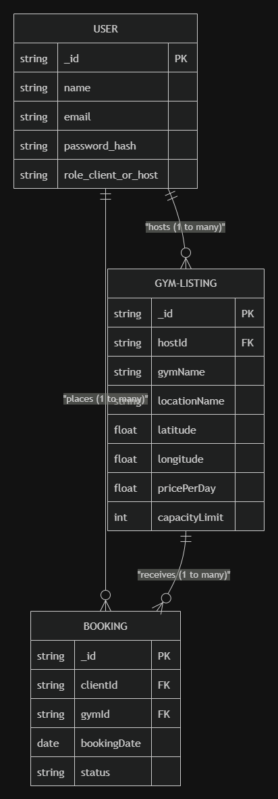
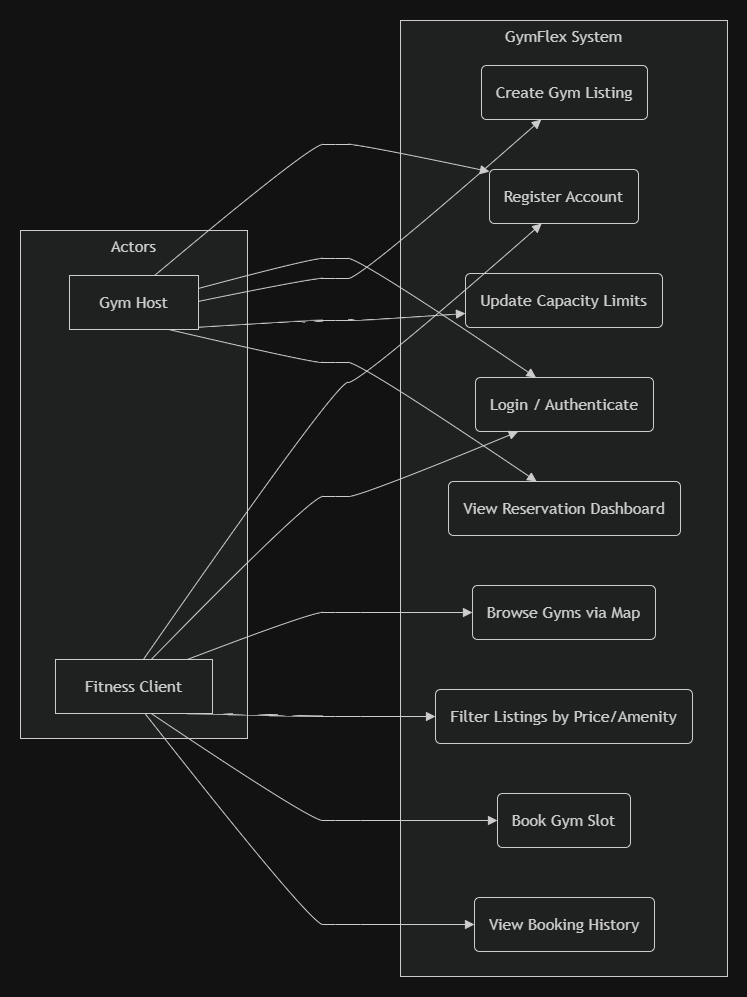
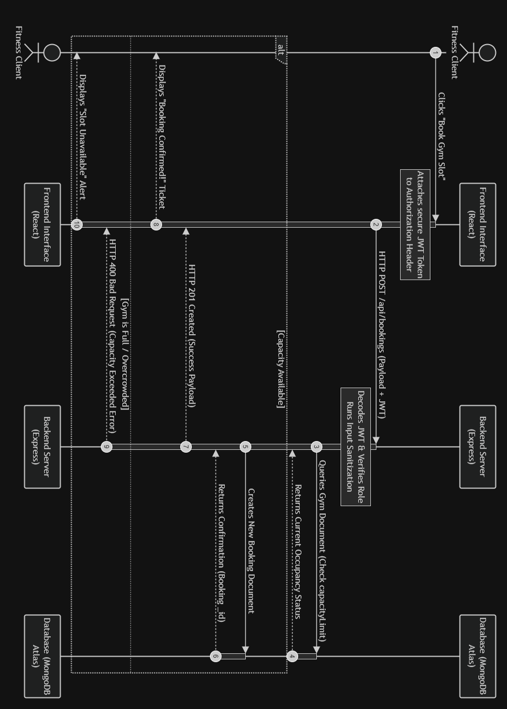

# GymFlex: Secure Gym-Booking Marketplace 🏋️‍♂️🔒

**Academic Mid-Term Progress Report & Technical Design Blueprints**  
*Course Project for APT 3065 (Systems Analysis and Design) — USIU-Africa*  
*Submitted to: Prof. Dr. Agnes Wamuyu*  
*Developer: Mark (Cybersecurity & Applied Computer Technology)*

---

## 1. Project Overview & Target Gap
GymFlex is a secure, map-based marketplace application designed to bridge the gap between fitness enthusiasts (Clients) and gym owners (Hosts). 
* **The Market Gap:** Traditional gym memberships are rigid and geographically restrictive. GymFlex offers dynamic, pay-as-you-go gym access while allowing local gyms to monetize underutilized, off-peak operational capacities.
* **Security Focus:** Built with a "Security-by-Design" approach. The platform protects sensitive user location tracking data, relies on secure Role-Based Access Controls (RBAC), and enforces cryptographic password hashing.

---

## 2. Progress Report: Completed Milestones (What I Have Done)
To optimize development under our strict 12-week constraints, the foundational system architecture and secure database layers have been successfully established:

* **[DONE] Systems Modeling & Design Blueprints:** 
  * Fully conceptualized and generated the **Entity Relationship Diagram (ERD)** to structure our NoSQL database.
  * Mapped out the **Use Case Diagram** to lock down client, host, and system boundaries.
  * Designed a high-security **Sequence Diagram** mapping secure JSON Web Token (JWT) authorization flows and input sanitization before database interaction.
* **[DONE] Source Control Strategy:** Established a standard GitFlow model. The repository is initialized with active, tracking `main` (production) and `develop` (integration) branches.
* **[DONE] Backend Prototype Bootstrapped:** 
  * Initialized Node.js runtime and configured `package.json`.
  * Wrote and successfully tested the baseline `server.js` file, verified running live on local port `5000`.

---

## 3. UI/UX Implementation & Progress Evaluation (July 15, 2026)
To ensure high system usability and intuitive navigation, the client-facing interfaces have transitioned from conceptual wireframes to interactive screen designs:

### A. Key UI/UX Highlights
* **Dynamic Training Dashboard:** Designed interactive schedule views, customized session counters, and workout guides to keep the user experience seamless and engaging.
* **Map-Based Marketplace Layout:** Mocked up the Leaflet.js-driven map layout containing real-time visual host markers for on-demand gym selections.
* **Role-Based Interfaces:** Formulated clean, visually distinct dashboards for both **Clients** (focusing on bookings, pass status, and tracking metrics) and **Hosts** (focusing on capacity caps, earnings, and active session slots).

### B. Progress Evaluation Matrix
Using our 12-week roadmap, the project's milestones are tracking as follows:

| Phase / Feature | Target Completion | Current Status | Cybersecurity & UX Verification |
| :--- | :--- | :--- | :--- |
| **System Blueprints** | Mid-Term | **100% Complete** | Architecture locked down; ERD, Sequence, and Use Case diagrams completed. |
| **Backend Core Server** | Week 9 | **100% Complete** | Node.js Express server configured and running locally. |
| **UI/UX Core Designs** | Week 10 | **95% Complete** | Fitness training schedule interfaces and layout mockups finalized. |
| **Interactive Maps** | Week 11 | **Active** | Bridging coordinates logic with Leaflet.js map layer. |
| **RBAC Security Audit** | Week 12 | **Pending** | Scheduled verification of JWT verification parameters and session end handshakes. |

---

## 4. Technical Design Blueprints

### A. Database Schema (Entity Relationship Diagram)
An optimized NoSQL structure utilizing document referencing (`ObjectId`) to maintain clean, scalable relationships between users, active gym listings, and reservations.



---

### B. Use Case Diagram
Maps out user interactions, functional requirements, and authentication boundaries for the client and gym host roles.



---

### C. Sequence Diagram (Secure Booking Process)
Highlights the step-by-step transaction logic, specifically showcasing JWT Token verification and real-time concurrency/capacity limit validation at the backend server layer.



---

## 5. Source Code Baseline (`server.js`)
The server actively runs and serves as our entry point:

```javascript
const express = require('express');
const mongoose = require('mongoose');
const cors = require('cors');
require('dotenv').config();

const app = express();

// Security Middleware
app.use(cors());
app.use(express.json()); // Sanitizes and parses incoming request bodies

// Baseline test route
app.get('/', (req, res) => {
    res.json({ message: "GymFlex Secure Backend is operational!" });
});

const PORT = process.env.PORT || 5000;

app.listen(PORT, () => {
    console.log(`Server running securely on port ${PORT}`);
});

---

## 4. Source Code Baseline (`server.js`)
The server actively runs and serves as our entry point:

```javascript
const express = require('express');
const mongoose = require('mongoose');
const cors = require('cors');
require('dotenv').config();

const app = express();

// Security Middleware
app.use(cors());
app.use(express.json()); // Sanitizes and parses incoming request bodies

// Baseline test route
app.get('/', (req, res) => {
    res.json({ message: "GymFlex Secure Backend is operational!" });
});

const PORT = process.env.PORT || 5000;

app.listen(PORT, () => {
    console.log(`Server running securely on port ${PORT}`);
});